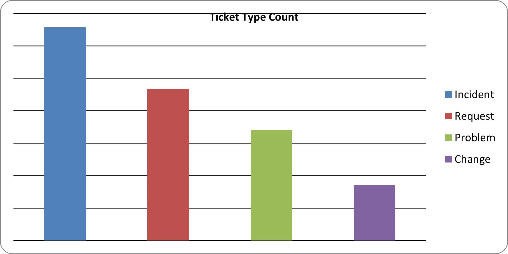
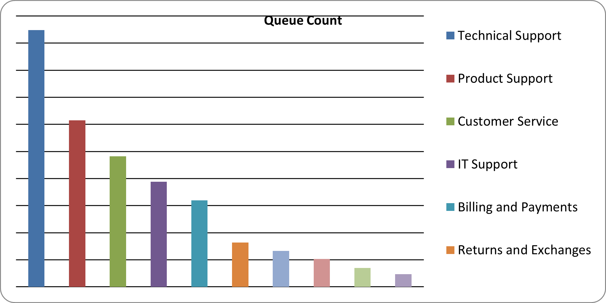
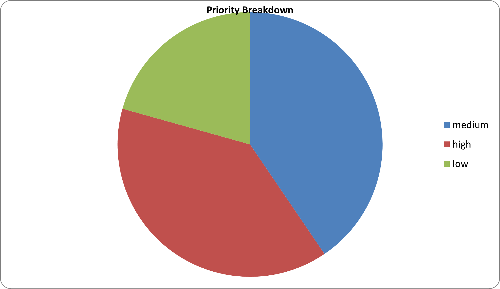

## Ticket Intelligence System:

This project analyzes a real-world dataset of multilingual customer support tickets to identify trends in issue types, departmental workload, and ticket prioritization. It focuses on English-language tickets to simplify initial insights while retaining the richness of real support data.

## Dataset Source:

Kaggle: [Multilingual Customer Support Tickets](https://www.kaggle.com/datasets/tobiasbueck/multilingual-customer-support-tickets)  
- Author: Tobias Bueck  
- 2.2M+ realistic synthetic tickets across 14 languages  
- Fields: `subject`, `body`, `priority`, `type`, `queue`, `language`, `tags`, etc.

## Objective:

To develop a basic Ticket Intelligence System that:
- Identifies the most common types of support issues
- Analyzes departmental workload based on queues
- Understands the distribution of ticket priority levels

## Tools Used:

- Excel (Pivot Tables & Charts)
- Python (Pandas – preprocessing)
- Dataset Filtered for English-language tickets only (`language = 'en'`)

## Key Visuals:

The following visualizations were generated from the filtered English dataset:

1. Bar Chart – Most Common Ticket Types
- Shows which issue types (e.g., Incident, Request, Problem) occur most frequently.
  
  
  

2. Bar Chart – Ticket Count by Queue (Team)
- Highlights which support teams (e.g., Technical Support, Billing, Returns) handle the most tickets.
  
  

3. Pie Chart – Ticket Priority Breakdown
- Displays how tickets are distributed across priority levels (e.g., high, medium, low).
  
  
  
All charts are embedded in the Excel workbook.

## Files Included:

| File Name | Description |
|-----------|-------------|
| `Ticket_dump_analysis.xlsx` | Contains raw dataset, pivot tables, and charts |
| `Ticket_Intelligence_Final.xlsx` | Contains filtered dataset with average sentiment, pivot tables and charts |
| `README.md` | Project overview and insights |

## Sample Insights:

- Most Common Ticket Type: Requests make up the majority of English-language tickets.
- Most Active Queue: Technical Support and Billing receive the highest ticket volumes.
- Priority Distribution: Majority of tickets are medium priority; high priority cases form a smaller share.

## Next Steps:

- Apply sentiment analysis to ticket bodies using NLP tools like TextBlob or VADER.
- Extend analysis to multilingual tickets.
- Predict ticket priority using classification models (future Project idea, something I might work on later).

## Outcome:

This project was created to demonstrate the ability to extract actionable insights from real-world support data using basic analytics tools — I consider this a foundational step for transitioning from IT Service Desk role into Data Analytics role since my work is mostly dependent on troubleshooting user's issues and resolving tickets.

